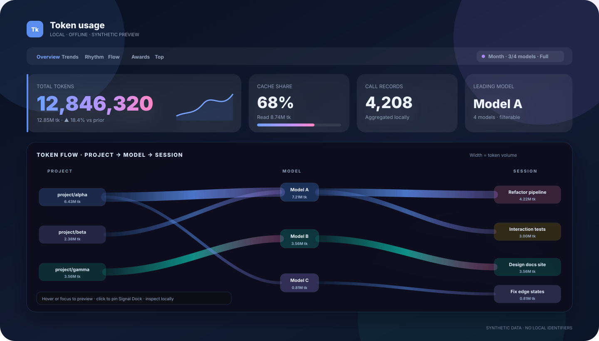
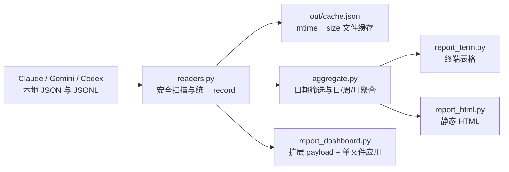

<div align="center">
  

# tokens

**把 Claude Code、Gemini CLI 与 Codex 的本地 Token 日志，变成一份可阅读、可探索、可离线保存的数据仪表盘。**

[](https://www.python.org/)
[](#设计原则)
[](#交互式-dashboard)
[](#隐私与安全)
[](LICENSE)

[快速开始](#60-秒快速开始) · [Dashboard](#交互式-dashboard) · [CLI 参考](#cli-参考) · [隐私](#隐私与安全) · [中文文档](docs/index.html)

</div>



> [!NOTE]
> 上图使用**合成数据**，不包含本机路径、真实会话标识或自然语言摘要。真实 `out/dashboard.html` 可能包含这些本地元数据，请勿未经检查公开分享。

## 为什么是 tokens？

AI 编程工具会留下大量本地使用记录，但不同 CLI 的日志结构、Token 口径和时间格式并不一致。`tokens` 用一条很短的本地数据管线完成：

- **统一读取** Claude Code、Gemini CLI、Codex 日志；
- **按本地时区归一**为日 / 周 / 月统计；
- **拆分模型、来源、小时、项目和会话**；
- 输出终端表格、单期静态 HTML 和完整交互式 Dashboard；
- 全程在本机运行，Dashboard 无 CDN、无远程脚本、无网络请求。

运行时只依赖 Python 标准库。克隆后即可使用，不需要 Node.js、数据库或前端构建工具。

## 60 秒快速开始

### 直接运行

```bash
git clone https://github.com/LingXi-fur/tokens.git
cd tokens

# 今天的终端报告
python3 cli.py

# 推荐：生成并打开交互式 Dashboard
python3 cli.py dashboard --open

# 生成标识脱敏的可分享版本
python3 cli.py dashboard --anonymize --open
```

### 安装为全局命令

```bash
pipx install .
tokens dashboard --open
```

要求：

- Python **3.9+**；
- 自动打开目前使用 macOS `open`；Linux 可生成后手动打开 `out/dashboard.html`；
- 至少存在一种受支持 CLI 的本地日志。

## 三种输出

| 输出 | 命令 | 适合场景 | 特点 |
|---|---|---|---|
| 终端报告 | `python3 cli.py week` | 快速查看、脚本工作流 | ANSI 表格，按模型拆分 |
| 静态 HTML | `python3 cli.py month --html --open` | 单期归档、轻量分享 | Python 预渲染 SVG，页面结构稳定 |
| 交互式 Dashboard | `python3 cli.py dashboard --open` | 深入探索、长期自用 | 日/周/月联动，单文件离线应用 |

生成结果位于 `out/`；该目录默认被 Git 忽略。

## 交互式 Dashboard

`python3 cli.py dashboard --open` 会生成 `out/dashboard.html`。数据、CSS 与 JavaScript 全部内嵌，双击即可离线打开。

### 统计与筛选

- 日 / 周 / 月三种粒度联动；
- 按模型堆叠柱状图、均值线、峰值标记与上一期幻影轮廓；
- 趋势柱图支持 roving tabindex：Tab 进入图表后，用左右方向键检查周期，Enter / Space 进入时光探针；
- 趋势图下方的数据时刻注释轨道复用范围里程碑、范围内项目首次观察和连续自然日主力变化；日 / 周 / 月会映射到对应周期，同周期事件自动合并，标记支持方向键和 Enter / Space；
- 总 Token、缓存命中、调用次数、模型数、主力模型与月末预测；
- 模型筛选支持点击、双击独看、`Alt` 点击全选/清空、右键反选；
- 模型筛选会同步重算 Token、调用次数、缓存、Top、项目透镜、作息与导出内容；
- 点击柱子进入“时光探针”，对单日、单周或单月重算局部视图；
- 当前视图胶囊显示粒度、模型筛选、时光探针与幻影对比状态；
- 当前 UI 状态可复制为链接，URL 只记录粒度、模型名、日期焦点、对比和主题，不记录 cwd、session 或 Token 明细；
- KPI 会从上一次显示值平滑过渡到新值；模型筛选、粒度、时光探针和幻影对比变化只短暂确认当前视图与受影响卡片，而不是让整页持续闪动；
- 动效支持 `auto` / `full` / `low` / `off`，并始终服从系统 `prefers-reduced-motion`。

### 时间与行为视图

- 数据时刻：从当前模型筛选中提取范围末端静默 / 连续活跃、本报告范围累计里程碑、范围内首次观察项目和连续自然日的唯一主力模型变化；安静日、日期缺口和并列主力会打断接力，点击可进入对应日期的时光探针；
- 数据气候、数据侦探与数据可信度实验室：基于本地规则生成洞察、字段覆盖体检和能力解释，不调用 AI；
- 近 5 小时计费窗口与近 14 天趋势；
- 24 小时作息时钟；
- 14 天 × 24 小时作息织锦，可直接点击小时格回看当天；
- 使用状态脉冲：升温 / 平稳 / 降温采用中性表达，不把 Token 增长解释为好坏。

### 数据宇宙

- **数据可信度实验室**：展示已解析记录中的时间戳、项目、会话与标准化 Token 组成字段可用性，以及“实际回放保留 / 可归属记录”；解析器拒绝的原始事件不在分母，每个会话最多保留最近 200 轮，并可复制不含 cwd、session 或逐轮明细的体检摘要；
- **项目透镜**：选择项目查看日 / 周 / 月堆叠趋势、当前占比、活跃期、峰值期与主力模型；响应模型筛选和时光探针，脱敏报告自动使用项目别名；
- **Context Reuse River**：将 Fresh Input、Output、Cache Read、Cache Write 与无法归类的 Other 按时间堆叠，所有分量严格回归各来源报告的 `total`；支持模型筛选、时光探针与键盘逐期检查；
- **Token 流光图**：展示真实聚合的“项目 → 模型 → 会话”流向；光带宽度对应 Token 量；项目和模型可锁定链路，会话可进入逐轮回放；当前视图可导出 SVG；
- **Top 项目 / 会话构成**：从完整日级实体按当前模型筛选重新聚合全范围或时光探针内 Top，过滤筛选后为 0 Token 的条目；会话行支持键盘回放，回放序列是完整会话总 Token 序列而非模型筛选后的序列；
- **会话回放检查器**：显示当前轮、累计 Token 和累计占比；支持滑块、播放以及直接点击 ECG 定位；横轴表示轮次，最多保留最近 200 轮；
- **柱图竞赛**：使用原生 range scrubber，可拖动或用方向键定位累计排名日期；
- **Token 生物**：总量、模型、项目、缓存和作息共同塑形，可导出 SVG；
- **Token 星云**：小时分布形成旋臂，模型形成星团，缓存点亮星核；
- **Token 年鉴**：把当前报告划分为可复算的个人赛季，用稳定星位展示个人纪录，并在同一浏览器打开后续不同快照时生成“过去的你 → 当前快照”的数据时间胶囊；只比较本设备历史，不声称全球排名；
- **成就中心**：展示最近解锁、报告范围内首次达到日期、距离最近的三个目标与精确剩余量；以青铜 / 白银 / 黄金 / 彩钻及阶梯门槛排名表达本地图鉴阶位，不声称全球用户稀有度；完整图鉴保留隐藏、搜索、筛选、分类折叠和可访问详情；
- 柱图竞赛、今日运势、趣味换算、Token 护照与 Token 收据。

### Token 年鉴：让快照拥有记忆

Token 年鉴不是另一个普通趋势图，而是一条只在本机生长的时间轴：

- **赛季星图**：以自然月为边界，并在同月内遇到至少 7 个连续静默自然日时切分章节；每个赛季展示活跃日、跨度、峰值、最长连续活跃、主力模型和中性的“初生 / 潮涌 / 恒定 / 回声 / 迁徙”等描述；
- **个人纪录天文台**：记录单日 Token、调用、小时峰值、缓存量与缓存占比、输入、输出、缓存写入、会话轮数、模型多样性和最长连续活跃等身份无关指标；星体位置由稳定纪录 ID 决定，不会在重渲染时随机跳动；
- **数据时间胶囊**：第一次打开只建立安静基线；以后在同一浏览器、同一作用域打开内容不同的新快照时，才展示总量变化、新纪录、主力模型迁移和新赛季章节；故事由用户用按钮或方向键推进，不自动轮播；
- **日期语义**：能够由日级聚合还原时显示报告范围内日期；浏览器观察时间只表示“本设备何时看到这份快照”，不冒充纪录真正发生的时间；
- **历史边界**：raw / anonymized、来源、`since`、固定 `until`、时区和指标版本组成独立作用域，不跨作用域拼接历史，也不把重叠的累计报告做加法。

本地年鉴使用 `tk-almanac-v1`，每个作用域最多保留 24 份紧凑快照，最多保留 8 个作用域。模块内可导出当前作用域 JSON，也可单独清除年鉴历史。它不保存 cwd、session ID、会话标题、项目 / 会话别名、逐轮 Token 或消息正文。

> [!IMPORTANT]
> “新纪录”和星等只表示相对本设备此前保存的快照，不是全球用户百分位。`file:` 页面的 localStorage 行为还取决于浏览器和文件来源；清除站点数据、换浏览器或换设备后，历史不会自动迁移。

### 成就中心：时间、进度与图鉴阶位

成就中心不再随机展示六枚徽章，而是围绕可回答的问题组织信息：

| 区域 | 回答的问题 | 语义 |
|---|---|---|
| 最近解锁 | 最近达成了什么？ | 优先展示可从日级聚合还原的最近记录 |
| 最近达成时间线 | 什么时候达到？ | 使用“本报告范围内首次达到”；范围首日已满足时明确标记边界状态 |
| 距离最近的目标 | 快要解锁什么？ | 每个可指导阶梯只推荐下一枚，显示当前值、目标值、百分比和精确剩余量 |
| 收藏与阶位 | 这枚成就有多高阶？ | 青铜 / 白银 / 黄金 / 彩钻与“该阶梯前 X% 门槛”描述本地图鉴门槛位置 |

> [!IMPORTANT]
> 图鉴阶位不是全球用户稀有度。项目没有收集多用户统计，因此不会显示“超过 99% 用户”或“仅 0.1% 开发者拥有”等无法验证的结论。

成就日期也有明确边界：

- 可由每日累计或最大值还原时，显示本报告范围内首次达到日期；
- 如果在范围第一天就已满足，显示“报告范围开始时已达成”，不声称历史首次；
- 对均值、比例、人格、隐藏彩蛋等无法可靠回放的条件，显示“解锁日期不可从当前聚合数据还原”；
- 星座、节日和日期彩蛋基于报告生成日期，而不是以后重新打开 HTML 的日期。

完整图鉴中的徽章是可聚焦按钮。点击或键盘激活后会显示解锁状态、日期精度、当前值、目标、剩余量、图鉴阶位与范围说明。第一次在浏览器中打开报告只建立观察基线；之后打开更新快照时，Dashboard 才会提示“本设备新观察到”的成就。Gold / Prismatic 可在完整运动模式下获得一次性强化反馈，低动效或关闭动效时改用静态高亮和状态播报。

### 快捷键与隐藏操作

按 `?` 可在 Dashboard 内打开完整帮助。

| 操作 | 快捷键 / 手势 |
|---|---|
| 切换日 / 周 / 月 | `1` / `2` / `3` |
| 打开命令面板 | `Cmd/Ctrl + K` |
| 切换自动 / 亮色 / 暗色主题 | `T` |
| 导出当前筛选 CSV | `E` |
| 退出时光探针或关闭弹层 | `Esc` |
| 打开快捷键帮助 | `?` |
| 切换数据侦探洞察 | `←` / `→` |
| 流光节点锁定 / 会话回放 | `Enter` / `Space` |
| 浏览年鉴赛季 / 时间胶囊章节 | `←` / `→`；`Home` / `End` 跳到首尾 |
| 打开赛季 / 纪录详情 | `Enter` / `Space` |
| 模型独看 | 双击模型 chip |
| 全选 / 清空模型 | `Alt` + 点击模型 chip |
| 反选单个模型 | 右键模型 chip |
| 总量显示格式切换 / 复制精确值 | 单击总量 / 点击复制按钮 |

## CLI 参考

```text
usage: cli.py [-h] [--since SINCE] [--until UNTIL]
              [--days DAYS] [--weeks WEEKS] [--months MONTHS]
              [--source {claude,gemini,codex}]
              [--html] [--dashboard] [--anonymize] [--open] [--no-cache]
              [{day,week,month,all,dashboard}]
```

### 位置模式

| 模式 | 默认窗口 | 输出粒度 |
|---|---:|---|
| `day` | 最近 14 天 | 日 |
| `week` | 最近 8 周 | 周一为周首 |
| `month` | 最近 6 个月 | 月 |
| `all` | 全部历史 | 日 |
| `dashboard` | 全部数据或显式日期范围 | 页面内日 / 周 / 月切换 |

### 参数

| 参数 | 说明 |
|---|---|
| `--since YYYY-MM-DD` | 起始日期；覆盖模式默认起点 |
| `--until YYYY-MM-DD` | 结束日期；普通报告默认今天 |
| `--days N` | `day` 模式回看天数，默认 14 |
| `--weeks N` | `week` 模式回看周数，默认 8 |
| `--months N` | `month` 模式回看月数，默认 6 |
| `--source SOURCE` | 限定来源，可重复使用；不传时读取 `config.DEFAULT_SOURCES` |
| `--html` | 为普通报告生成单期静态 HTML |
| `--dashboard` | 生成交互式 Dashboard，等价于位置模式 `dashboard` |
| `--anonymize` | 仅用于 Dashboard：以报告级稳定别名替换项目路径、会话标识与自然语言标题，输出 `out/dashboard-anonymized.html` |
| `--open` | 生成 HTML 后调用 macOS `open` |
| `--no-cache` | 忽略文件缓存并强制重读日志 |

### 常用组合

```bash
# 本周 + 最近 8 周
python3 cli.py week

# 自定义日期范围
python3 cli.py all --since 2026-07-01 --until 2026-07-31

# 合并多个来源
python3 cli.py dashboard \
  --source claude \
  --source gemini \
  --source codex \
  --open

# 生成标识脱敏 Dashboard；保留精确日期、Token、模型、流光关系与匿名会话回放
python3 cli.py dashboard --anonymize --since 2026-07-01 --until 2026-07-31

# 强制重新解析日志
python3 cli.py day --no-cache
```

## 数据来源与统计口径

| 来源 | 默认日志位置 | `total` 口径 | 项目 / 会话能力 |
|---|---|---|---|
| Claude Code | `~/.claude/projects/**/*.jsonl` | input + output + cache read + cache write | 包含 cwd 与 session；支持项目 Top、会话回放和完整流光关系 |
| Gemini CLI | `~/.gemini/tmp/<hash>/chats/session-*.json` | 日志的 `tokens.total`；回退为 input + output + cached + thoughts + tool | 当前解析器保留 session，但通常没有 cwd |
| Codex | `~/.codex/sessions/YYYY/MM/DD/rollout-*.jsonl` | `total_tokens`；input 已包含 cached input，不重复相加 | 当前解析器通常没有 cwd 和 session |

> [!IMPORTANT]
> 不同 CLI 的 Token 统计口径并不完全相同。项目忠实保留各来源报告值，以便趋势和来源内比较；跨来源比较时应理解上述差异。

### 统一 record

读取器会把不同日志归一为：

```python
{
    "source": "claude | gemini | codex",
    "ts": "原始 ISO 时间戳",
    "date": "本地日期 YYYY-MM-DD",
    "model": "模型名",
    "input": 0,
    "output": 0,
    "cache_read": 0,
    "cache_write": 0,
    "total": 0,
    "session": "可选会话标识",
    "cwd": "可选工作目录",
}
```

所有日期按 `config.TZ` 转换；当前默认是 `Asia/Shanghai`，可在 `config.py` 修改。

## 工作原理



### 缓存与输入防护

`readers.py` 对本地输入做了几项保护：

- 缓存键由文件 `mtime_ns + size` 组成；
- 缓存结构带版本号，解析口径改变时自动失效；
- 拒绝软链接、FIFO、设备文件和超大文件；
- 单文件默认上限 64 MiB，JSONL 单行默认上限 4 MiB；
- 单个损坏文件不会终止整次统计；
- 缓存通过随机临时文件写入，并设置为 `0600` 后原子替换。

## 隐私与安全

`tokens` 不上传日志，生成的 Dashboard 也不发起网络请求。但“本地生成”不代表“已经匿名”。

### `out/dashboard.html` 可能包含

- 完整 cwd / 项目路径；
- session 标识；
- 每个会话的逐轮 Token 序列；
- 为成就范围时间线提供的紧凑日级 input、output、cache write、来源量和截至当日最大会话轮数聚合；
- 来自 `out/session_summaries.json` 的摘要；
- 或从 Claude 会话第一条有效用户文本提取的标题。

### 脱敏 Dashboard

`python3 cli.py dashboard --anonymize` 会生成独立的 `out/dashboard-anonymized.html`：

- 完整 cwd、项目短路径、原始 session ID、sidecar 摘要和会话首条文本标题不会进入报告；
- 同一项目/会话在本次报告内使用稳定的 `Project-…` / `Session-…` 别名，Top、流光关系和逐轮回放仍可联动；
- 每次生成使用新的本地随机密钥，不把密钥写入 HTML、URL 或缓存，因此不同报告默认不能直接用别名关联；
- 精确日期、Token 数值、小时分布、模型、来源和逐轮 Token 序列仍然保留。

这属于**假名化而非完全匿名**。活动时间、模型别名、精确数值和回放序列仍可能形成行为指纹；自定义模型名也可能包含组织或项目语义。公开发布前仍应检查生成文件，并优先使用受限日期范围。

本地 `file:` 页面复制视图链接时只复制文件名和 UI 状态，不再复制本机绝对路径；粒度、模型选择、焦点日期、对比和主题仍会出现在链接中。

成就中心另使用浏览器 `localStorage` 保存版本化的稳定成就 ID、报告生成时间和有限数量的快照作用域，用于判断“本设备此前是否观察过”。它不会把浏览器观察时间当成实际解锁日期，也不会在这部分存储 cwd、session 或逐轮 Token 序列。清除站点数据后，该观察基线会重置。

Token 年鉴使用独立的 `tk-almanac-v1` 保存身份无关的紧凑历史：snapshot ID、生成时间、覆盖边界、聚合总量、模型构成、个人纪录和赛季摘要。每个作用域最多 24 份、最多 8 个作用域；raw / anonymized、来源、范围、时区和指标版本彼此隔离。它不会保存 cwd、session、标题、匿名实体别名、逐轮序列或正文。模块内可导出当前作用域，也可单独清除此 key；导出的 JSON 仍包含精确日期、模型和 Token 数值，分享前仍需检查。

### 分享前检查清单

- [ ] 优先使用 `dashboard --anonymize`，不要误传原始 `out/dashboard.html`；
- [ ] 搜索 `/Users/`、`/home/` 和本机用户名；
- [ ] 检查客户名、仓库名、项目路径和分支语义；
- [ ] 检查会话标题、摘要、session 标识与自定义模型名；
- [ ] 评估精确日期、小时分布和逐轮序列是否适合目标接收者；
- [ ] 优先分享脱敏截图、合成数据演示或终端汇总；
- [ ] 不要直接把真实原始 Dashboard 上传到公开 Issue、Pages、网盘或聊天群。

详见 [数据与隐私文档](docs/data-and-privacy.html)。

## 设计原则

- **stdlib-only runtime**：运行数据管线不引入第三方 Python 包；
- **offline-first**：Dashboard 是自包含文件，没有 CDN 和远程运行时资源；
- **generated, not hand-edited**：修改 `dashboard_payload.py` 与 `dashboard_assets/template.html` / `dashboard.css` / `dashboard.js`，由 `report_dashboard.py` 组装后重新生成 `out/dashboard.html`；
- **progressive detail**：核心统计优先，数据宇宙与彩蛋可通过模块开关隐藏；
- **accessible interactions**：主要 SVG 节点可键盘操作，支持焦点状态与 `prefers-reduced-motion`；
- **privacy is explicit**：项目不会把“聚合”误称为“匿名”。

## 项目结构

```text
tokens/
├── cli.py                    # 参数解析与模式路由
├── config.py                 # 路径、时区、默认来源、模型别名
├── readers.py                # 三类日志解析、安全扫描、缓存
├── aggregate.py              # 日 / 周 / 月与模型 / 来源聚合
├── report_term.py            # 终端 ANSI 报告
├── report_html.py            # 单期静态 HTML
├── report_dashboard.py       # 组装 payload、模板、CSS 与 JS 为单文件 Dashboard
├── dashboard_payload.py      # 单次扫描聚合、回放、完整日级实体与成就时间线数据
├── dashboard_wire.py         # Dashboard payload 的紧凑版本化编码
├── dashboard_assets/         # Dashboard HTML 模板、CSS 与浏览器交互逻辑
├── pyproject.toml            # 包元数据与全局 tokens 命令
├── docs/                     # 零构建中文文档站
├── tests/
│   ├── test_dashboard.py     # payload、模板、交互结构测试
│   └── test_docs.py          # 链接、资源、无障碍与隐私检查
└── .github/workflows/pages.yml
```

## 开发与验证

```bash
# 全部测试（当前 57 项）
python3 -m unittest discover -s tests -v

# Python 与浏览器脚本语法检查
python3 -m compileall -q .
node --check dashboard_assets/dashboard.js

# 重新生成原始与标识脱敏 Dashboard
python3 cli.py dashboard
python3 cli.py dashboard --anonymize

# 本地预览文档站
python3 -m http.server 8000 --directory docs
# 打开 http://localhost:8000/

# 检查补丁空白问题
git diff --check
```

项目测试使用 `unittest`，不要求 pytest。Dashboard 测试使用合成 records，不读取真实本地会话内容。

## 中文文档与 GitHub Pages

完整文档位于 [`docs/`](docs/index.html)：

- [快速开始](docs/getting-started.html)
- [CLI 参考](docs/cli.html)
- [Dashboard](docs/dashboard.html)
- [数据与隐私](docs/data-and-privacy.html)
- [架构](docs/architecture.html)
- [FAQ](docs/faq.html)

文档站同样零构建、无 CDN，支持响应式布局、自动 / 亮色 / 暗色主题、`Cmd/Ctrl+K` 搜索、移动导航、代码复制和阅读进度。

仓库包含 [Pages workflow](.github/workflows/pages.yml)。在 GitHub 仓库设置中将 Pages Source 设为 **GitHub Actions** 后，推送 `docs/**` 或相关测试会先执行测试，再发布文档。

## 已知限制

- `--open` 当前只实现 macOS `open`；
- Dashboard 是生成时快照，不会自动监听日志变化；成就中心和 Token 年鉴的“本设备新观察到”都需要在同一浏览器、兼容的本地文件来源中打开后续更新快照；`file:` localStorage 的隔离方式可能因浏览器而异；
- 成就日期受报告范围与聚合可重建能力限制；图鉴阶位描述目录门槛，不提供全球用户稀有度；
- Gemini / Codex 日志缺少 cwd 或 session 时，项目 / 会话类视图会自然减少；
- 跨来源 Token 口径不是完全同构；
- 当前是扁平顶层模块布局，尚未迁移到 `src/tokens/` 包；
- 暂不内置模型价格表，因此没有成本估算。

## Roadmap

- [ ] 模型价格表与可配置成本估算；
- [ ] `tokens serve` 本地自动刷新；
- [ ] Windows `os.startfile` 与 Linux opener 兼容；
- [x] 项目透镜：项目日 / 周 / 月趋势、模型构成与焦点联动；
- [ ] 扁平模块迁移到正式包结构；
- [x] 可选的 Dashboard 标识脱敏导出模式。

## License

[MIT](LICENSE)
