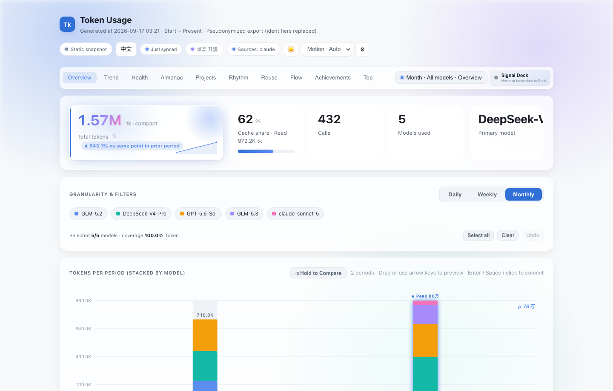

<div align="center">
  

# tokens

**See where your AI coding tokens go — without sending your logs anywhere.**

Turn local Claude Code, Gemini CLI, and Codex records into terminal summaries, a loopback-only live dashboard, or one self-contained offline HTML file.

[](https://lingxi-fur.github.io/tokens/demo/)
[](https://github.com/LingXi-fur/tokens/actions/workflows/ci.yml)
[](https://github.com/LingXi-fur/tokens/blob/main/pyproject.toml)
[](https://github.com/LingXi-fur/tokens/blob/main/LICENSE)
[](#privacy)

[Try the interactive demo](https://lingxi-fur.github.io/tokens/demo/) · [Clone and run](#clone-and-run) · [Docs](https://lingxi-fur.github.io/tokens/) · [Dashboard guide](https://lingxi-fur.github.io/tokens/dashboard.html) · [中文说明](https://github.com/LingXi-fur/tokens/blob/main/README.zh-CN.md)

**See it before using your own data:** explore the [synthetic dashboard](https://lingxi-fur.github.io/tokens/demo/) in your browser. No install, account, or local logs needed. The hosted preview is interactive, not a live view of your machine. To run it locally without logs, use `./run demo --open` after cloning.

</div>

[](https://lingxi-fur.github.io/tokens/demo/)

> Preview generated by the real dashboard from invented records. It contains no real local logs, private paths, session identifiers, or router configuration.

## Try it without installing or using your own logs

Open the [interactive synthetic demo](https://lingxi-fur.github.io/tokens/demo/) to explore the dashboard with invented records. It does not refresh from your machine. After cloning, `./run demo --open` generates the same kind of local-only sample report.

## Why use it?

AI coding tools already leave usage records on your machine, but each tool stores and counts them differently. `tokens` gives you one inspectable local view:

- **See usage from Claude Code, Gemini CLI, and Codex** in one report while keeping each source's reported token semantics visible.
- **Find changes worth inspecting:** daily, weekly, and monthly trends, two-period comparisons (with a dominant-model shift badge when the top model changes), and peak periods. Copy a compact text summary of the current view—with its delta when available—into notes or messages.
- **Follow token destinations:** a project and model overview beside per-session cards, tracing model, source, project, and session details where the logs provide them.
- **Keep results under your control:** exact tables, CSV and Markdown exports, local live refresh, or a self-contained offline HTML snapshot.

The local CLI and dashboard require no account, telemetry endpoint, hosted backend, or external runtime assets; your AI coding tools and this documentation site have their own network policies. Core parsing, aggregation, reporting, and loopback serving use the Python standard library. Windows additionally needs the data-only `tzdata` package for consistent IANA timezone support.

## Clone and run

Requirements: Python 3.9 or newer on macOS, Linux, or Windows. To analyze your own usage, you also need existing local logs from a supported AI coding CLI; the synthetic demo needs no logs.

```bash
git clone https://github.com/LingXi-fur/tokens.git
cd tokens
./run doctor
./run serve --open
```

Claude is the default source. If you use Gemini CLI or Codex, add `--source gemini` or `--source codex` to `serve`; repeat `--source` to combine sources. Otherwise, their logs will not appear.

`./run doctor` checks paths, candidate file counts, timezone, output, and cache permissions. It does not parse message contents or print project and session identifiers.

`./run doctor --models` explains how Claude usage was attributed to models. It reads records through the normal cached reader path, groups them by the logged request name and the resolved model, and labels each group's basis: `logged` (a backend name stored as-is), `hex_alias` (a CCR `anthropic/claude-ccr-h…` alias decoded to its backend), `native_direct` (a direct Anthropic request kept and normalized, for example `claude-opus-5-5` → `claude-opus-5.5`), or `router_rule` (a tier alias rewritten by the current router). The report lists the router file path and its current rules, then shows record counts, token totals, and first/last dates only—never cwd, session ids, or project names. Add `--since`/`--until` (`YYYY-MM-DD`, interpreted in the report timezone) to narrow the window, for example to today, and `--json` for machine-readable output. Plain `./run doctor` still checks the environment only and does not read logs.

The live dashboard binds only to `127.0.0.1`. A background worker checks local logs every five minutes by default (`--interval`); page requests read the latest successful in-memory snapshot without waiting for a scan. The page checks for published updates at most every minute by default, with shorter checks while data is being prepared. Its 1, 5, 15, or 30 minute selector and pause control affect browser checks only, not background scans. Initial preparation is shown explicitly; later scan failures keep the last successful data visible with its last successful check time. Unchanged files are not reparsed.

Browser checks use the small `/api/status` response; the full `/api/snapshot` is fetched only when needed. Older servers without the status endpoint retain conditional snapshot polling. Scan details show discovery, collection, payload building, and encoding, plus elapsed time, successfully processed files, discovered candidates, cache hits, parses, and skips. Discovered candidates are a running count, not a known total: these numbers are **not a completion percentage or an ETA**. A single large file can take time without changing the counters. Paused, hidden, or disconnected pages retain the last received state rather than inventing a heartbeat. Timings diagnose work; they do not promise a speedup.

**Integration status:** the reader-level memo is implemented, but `serve` is not wired to it yet; the following describes the pending service integration, not an enabled runtime feature.

Non-anonymous `serve` with caching enabled also keeps a bounded, per-process memo of successfully processed Claude/Codex files. After a later file fails, a retry can reuse unchanged earlier files while still securely reopening them and rerunning cross-file conflicts and collection limits. Failed files are retried, not skipped; no partial report or partial disk cache is published. Cache-hit counts include disk and in-process reuse. The memo is limited to 4,096 files, 100,000 records, and 64 MiB of estimated retained data (not a process RSS cap), with at most 8 MiB / 20,000 records per file; oversized entries are not retained. Restarting clears it, changed files/configuration invalidate reuse, and unsupported parser/timezone contexts bypass it. Files whose output records contain timestamps without an explicit UTC offset are also excluded from in-process reuse; parsing still follows the existing rules. When a sequential scan exceeds the memo's capacity, LRU eviction can leave the next scan with no hits; the limits do not guarantee a speedup. `--no-cache` and anonymous mode disable the memo. This can reduce repeated parsing after failures, not the first cold scan or the underlying conflict.

With caching enabled, non-anonymous `serve` can keep one successful dashboard snapshot in `live-snapshot/last.json` under the local cache directory (`~/Library/Caches/ai-cli-tokens` on macOS). A compatible snapshot appears immediately after restart, marked as restored with its original timestamps, while a full scan revalidates it. Failed or partial scans never replace it. This is the dashboard's aggregate data, including project/session labels and titles already present in the report—not raw conversation logs, but still potentially private. Storage stays local, with a private POSIX directory (0700) and file (0600); no upload is added. Integrity hashes detect damage, not malicious changes by another process running as the same user; this is not a same-user security boundary. `--no-cache` disables both record and snapshot cache reads/writes. Anonymous mode, Windows without equivalent ACL validation, and environments without a stable timezone identity do not persist or restore snapshots. Invalid, unsafe, or incompatible files are ignored; a write failure leaves valid in-memory data visible with a storage warning. Recovery requires a previous complete success: it cannot turn an initial collection failure, including a Codex usage conflict, into valid data.

No local logs yet? Open a full synthetic dashboard generated through the same reporting pipeline:

```bash
./run demo --open
```

The demo writes `out/dashboard-demo.html` from generated sample data only. It does not read Claude Code, Gemini CLI, or Codex logs.

Create an offline archive instead:

```bash
./run dashboard --open
```

### Windows source checkout

Install the checkout in a local virtual environment first. This also installs the required `tzdata` package:

```powershell
git clone https://github.com/LingXi-fur/tokens.git
cd tokens
python -m venv .venv
.\.venv\Scripts\Activate.ps1
python -m pip install -e .
tokens doctor
tokens serve --open
```

If you use Gemini CLI or Codex, add `--source gemini` or `--source codex` to `tokens serve --open`.

### Optional local command install

From the cloned checkout, install an editable command into a virtual environment:

```bash
python -m venv .venv
source .venv/bin/activate        # Windows PowerShell: .venv\Scripts\Activate.ps1
python -m pip install -e .
tokens doctor
tokens serve --open
```

This installs from your local checkout. No package-registry release is required by these instructions.

### Local 0.3.0 candidate — not a public release

The 0.3.0 material in this checkout is a **local release candidate**, not a public release. No public release date or PyPI availability of 0.3.0 is claimed. The instructions below are a local installation recipe, **not evidence that the candidate has already been built or tested**. Candidate builds, artifact review, clean-environment smoke tests, and service updates installed from candidate artifacts must pass the candidate release checklist (`docs/release-candidate-checklist.md` in this local checkout) first; an external release requires separate approval. A separately authorized restart of a tested source-checkout service is not a candidate-artifact verification and does not mark those checklist items complete.

If you receive a verified local candidate wheel, install it without contacting an index or resolving dependencies:

```bash
python3 -m venv /tmp/tokens-030-venv
/tmp/tokens-030-venv/bin/python -m pip install --no-index --no-deps /ABSOLUTE/PATH/TO/ai_cli_tokens-0.3.0-py3-none-any.whl
/tmp/tokens-030-venv/bin/tokens --version
/tmp/tokens-030-venv/bin/tokens demo --output /tmp/tokens-030-demo --open
```

Replace the wheel path with the actual approved artifact; the path is a placeholder, not a download location. Use fresh destination directories (or choose other fresh paths). `--no-deps` deliberately skips dependencies. On Windows, make the venv and use its `Scripts\python.exe` / `Scripts\tokens.exe`; `tzdata` must already be available or be installed separately from a reviewed local wheel with the same offline flags. Missing local tools or dependencies are a blocker, not permission to download them. Platform support is a product requirement, not proof that this candidate has passed that platform's checks.

Alternatively, run the **approved candidate source checkout** directly, without an install or package registry:

```bash
cd /ABSOLUTE/PATH/TO/APPROVED/CANDIDATE/SOURCE
./run --version
./run demo --output /tmp/tokens-030-source-demo --open
# Portable source launcher (set PYTHONPATH only for this command):
PYTHONPATH=src python3 -m tokens_cli demo --output /tmp/tokens-030-source-demo --open
```

That explicit source-run path is separate from the checklist's wheel verification, which clears `PYTHONPATH` and checks that imports originate in the installed venv. The monthly-budget specification (`docs/monthly-budget-design.md` in this local checkout) is design-only in this round; it does not add a budget feature or create browser budget storage.

## Choose an output

| Goal | Source-checkout command | Behavior |
|---|---|---|
| Quick terminal summary | `./run day` | Last 14 days in the terminal |
| Try before installing | [Open the hosted synthetic Demo](https://lingxi-fur.github.io/tokens/demo/) | No clone, account, local logs, or upload |
| Explore locally without logs | `./run demo --open` | Synthetic data only; writes `dashboard-demo.html` |
| Keep a dashboard open | `./run serve --open` | Loopback-only service with in-page updates |
| Save an offline archive | `./run dashboard --open` | Self-contained generation-time snapshot |
| Prepare a safer sharing copy | `./run dashboard --anonymize --open` | Pseudonymizes selected identifiers |

Reports are written to `./out` by default. Use `--output DIR` to choose another location.

## What can you learn?

Find your busiest days, compare two equal-length periods, and see which **recorded** models, projects, or sessions contributed to the difference. Names folded into `Other` are listed beside the model filters with their token totals for the current period. They share the `Other` color and group filter, not separate model filters; anonymized reports do not expose unavailable names. When source records provide the fields, you can:

- **Spot changes:** explore daily, weekly, and monthly trends, peak periods, and token composition.
- **Follow the records:** filter by source and model, inspect project and session aggregates, and see original model names grouped under Other in a non-anonymized dashboard.
- **Check the numbers:** switch from charts to exact tables, export CSV or Markdown, or save a self-contained offline HTML snapshot.

The interactive [Dashboard guide](https://lingxi-fur.github.io/tokens/dashboard.html) covers the A/B interval lens, peak profile, keyboard controls, achievements, and other views. A/B compares recorded token contributions; it does not establish why usage changed. A zero baseline reports absolute Token change only. Projects and sessions are parallel aggregates, not automatically paired. Selected A/B periods and an open peak profile may be restored from the URL; project/session IDs and exact token details are not written there.

Token change describes usage, not productivity or code quality. Cache Read is cached-token volume, not guaranteed monetary savings.

### Local cost estimates

The **Cost ledger** estimates model costs from independently recorded billing components. It ships with built-in official **reference prices** for twenty-six exact model names and also accepts prices you enter under **Set prices**. With no local settings, it shows USD reference estimates by default and writes nothing to browser storage until you save.

- **Built-in reference prices** are official USD rates per million tokens, verified on 2026-11-06 for twenty-seven precise model names, all at each model's official rates: OpenAI Standard short-context tiers (≤272K), the Anthropic Claude lineup (cache writes at the 5-minute tier), DeepSeek peak-time baselines, Z.ai international USD rates (not the domestic Zhipu equivalent, with GLM's limited-time-free cache writes recorded as zero and bare provider-prefixed records like `zhipu/glm-5.3-flash` listed separately at the same backend's rates), and Moonshot Kimi. The page never requests them from a provider; published rates travel with the page assets, and vendor source links open only when you click them.
- **Manual prices** are keyed by log source and original model, including individual models grouped under Other, and take full priority over the built-in reference for that entry. A log source is not a provider or billing channel; model names may reflect routing aliases rather than billing SKUs. A configured zero price is free usage, while a blank price remains unknown. Saving an all-empty set keeps that explicit choice instead of letting reference prices fill back in, and CNY never draws on the USD reference prices. Gemini thoughts are a separate component.
- **Set prices** includes a **Use official reference price (USD)** switch. If the current currency is CNY with prices already entered, enabling it first asks you to confirm, then does both at once: it clears your custom entries including notes and switches to USD. No exchange rate is assumed and entries are not converted; cancelling keeps the current prices and currency. Configurations saved before this switch existed carry no reference flag, so they keep their currency and manual prices with the reference layer off.
- **Restore official reference** acts on one model at a time inside the price editor. It appears only for a USD draft with the reference layer on, a non-hidden model whose exact name hits a built-in reference, and a saved override for that source/model — an all-empty entry, an explicit zero, or a note-only entry all count as overrides. Confirming clears that entry's unit prices and note only; other models are untouched. Cancelling changes nothing, and closing the editor without saving persists nothing. Re-entering a price afterwards creates a normal override again.
- **Export CSV** downloads the current cost ledger locally on click: no fetch, no new endpoint, nothing exported until you press the button. It follows the current granularity, selection, model filters, currency, and effective prices, and includes every entry regardless of pagination. Rows carry row type, range, source/model, currency, pricing status, the five billing components with tokens, effective unit prices, and estimated amounts — never sessions, titles, project paths, or notes. Reference-priced, manually priced, pending, and hidden rows stay distinct; unknown stays blank while an explicit zero means free. Amounts are exact decimals from the scaled-integer cost pipeline, not display rounding. Summary records carry unknown calls/tokens, invalid rows, incomplete totals, the priced subtotal, and the full-estimate flag; with no priceable amount the amount stays blank, and the file never invents a complete total. Cells are escaped against delimiters and dangerous formula prefixes.
- The ledger follows model filters, reporting granularity, and the selected period. It shows an **estimated total** only when the entire selection can be priced reliably; otherwise it shows a **priced subtotal** and unpriced or uncertain coverage. Unsupported or inconsistent token components are not guessed. If reported token totals are invalid or cannot be represented safely, token coverage is unavailable; call coverage remains visible.
- Costs are unified reference-or-manual estimates for the selected range, not the amount a billing channel actually charged. Records are daily, so the ledger cannot identify per-context or per-time-period discounts, and it does not fold subscription plans, cache storage, or similar costs into spend. A combined cache-write rate is a user-confirmed effective rate, not automatic 5-minute/1-hour tier accounting.
- One currency is used at a time (CNY or USD). Changing currency requires clearing and re-entering rates; no exchange rate is assumed.
- Price settings stay in this browser under the existing `tk-cost-v1` local-storage key, with no provider calls or API keys and no new storage key; readers and usage statistics are unchanged. Manually entered private prices are not embedded in the report. Browser storage for a live page and an offline file may be separate; if storage fails, settings remain available for the current page only.

Older offline snapshots without billing data must be regenerated to use the ledger. The current record cache file is `records-v8.json`; its internal schema version (currently 20) covers Codex event identities, corrected output accounting, accepted zero-usage and bounded context-estimate updates, the mixed-format union accounting contract, cumulative recomputation treated as a new ledger baseline, unconditional first-sight evidence for repeated cumulative anchors (including across model changes, so consumption after a model-switch resume is attributed to the first-seen model), and Claude records keeping the original request model name alongside the router-resolved backend name as an informational field that never changes counting, dedup, or cost attribution. Older cache files are retained.

## Supported sources

| Source | Default local path | Project data | Session data | Accounting note |
|---|---|---:|---:|---|
| Claude Code | `~/.claude/projects/**/*.jsonl` | Yes | Yes | Total is input + output + cache read + cache write. |
| Gemini CLI | `~/.gemini/tmp/*/chats/session-*.json` | Usually no | Yes | Uses source `tokens.total` when available. |
| Codex | `~/.codex/{sessions,archived_sessions}/**/rollout-*.jsonl[.zst]` | Usually no | Usually no | Cached input is included in input; reasoning is included in output. Neither is added twice. Compressed archives require an existing local `zstd` executable. |

Claude is the default source. Repeat `--source` to combine tools:

Codex `.jsonl.zst` archives require `zstd` to be discoverable on the collecting process's `PATH`; uncompressed logs do not. A background service can have a different environment from an interactive terminal. `./run doctor --source codex` reports dependency discovery for the process running that command, not necessarily the background service. If collection reports `collection · codex · decompressor_unavailable`, check the service's environment rather than skipping archives; the existing service must reload its configured environment before that change takes effect. Enabling a source is not proof of collected usage: verify a successful snapshot and actual source records.

A `collection · codex · usage_conflict` error is an integrity failure, not a missing decompressor. It can mean inconsistent evidence for one response or cumulative anchor, or conflicting duplicate identities across active and archived files. This public code alone does not identify which check failed or prove a producer bug. New live Dashboard/API responses can additionally include the fixed `error_details.conflict_kind` codes below; older servers and failures without a subcode retain the generic diagnostic. These codes name the failed check, not which underlying field or copy is correct. CLI errors remain generic.

| `conflict_kind` | Failed check |
| --- | --- |
| `modern_response_mismatch` | Usage, model, or billing evidence differs for one modern response identity within a file. |
| `legacy_cumulative_rollback` | Retained as an error code for compatibility, but no longer triggered: a legacy cumulative `total_tokens` decrease starts a new ledger baseline instead of failing. |
| `legacy_anchor_mismatch` | Retained as an error code for compatibility, but no longer triggered within a file: repeated legacy cumulative anchors keep first-sight evidence, including across model changes. |
| `cross_file_identity_mismatch` | Usage, model, or billing evidence differs for one duplicate usage identity across files; this is not limited to modern responses. |

For `legacy_anchor_mismatch` only, `error_details.mismatch_kind` can further identify the differing groups: `usage`, `model`, `billing`, `usage_model`, `usage_billing`, `model_billing`, or `usage_model_billing`. Usage means the existing six-field usage signature; billing also distinguishes missing fields from explicit zeroes. The dashboard displays fixed group labels, never the compared values, model names, paths, or session identifiers. Missing or invalid detail retains the generic anchor explanation. These groups do not establish the cause, select a correct copy, or mean statistics have recovered.

Two narrow state updates are accepted without adding another consumption record. Both require adjacent legacy events under the same session and model, complete unchanged cumulative counters, and an original trusted positive usage at that anchor. The new last usage must have explicit integer-zero components and either a trusted zero total, or a positive total strictly below the original last total and no greater than the cumulative total, with `total_mismatch` as its only billing uncertainty. Codex can replace last usage with a context estimate while leaving cumulative spending unchanged; the estimate is not new spending. The original record and billing remain untouched. This shape does not authenticate the producer or establish the cause of a local conflict. Standalone total-only records are not filtered; incomplete evidence, other billing uncertainty, model changes, broken adjacency, or subsequent differing consumption still follow the original checks.

Modern records never break the legacy adjacency evidence behind those updates. Legacy `token_count` events are the ledger baseline: real producer logs persist modern responses only partially and out of order, so neither side alone is a complete record. A mixed-format file therefore counts the union of both formats: every legacy consumption counts once, and a modern record whose exact (usage, model, complete billing) value matches an unused legacy entry is absorbed as its mirror rather than counted again. Modern records beyond that multiset intersection join the ledger as independent consumptions—real producers persist incomplete responses in the modern format only. Because legacy events have no response ID, this value matching cannot prove that a modern record mirrors a specific legacy entry: a distinct real consumption equal in value to a legacy entry is absorbed into it and undercounted. That direction is structural under this contract; arbitrary mixed logs are not guaranteed to merge losslessly, and passing these checks does not establish that local statistics have recovered.

Collection stops without publishing partial totals; any last successful snapshot remains visible. Keep original logs and caches intact—do not delete archives, pick an arbitrary copy, or relax checks to obtain a total. `doctor` does not parse usage events and cannot resolve this conflict; investigate with synthetic reproductions or explicitly authorized, de-identified evidence rather than uploading conversation logs.

```bash
./run serve \
  --source claude \
  --source gemini \
  --source codex \
  --open
```

Different tools do not expose identical token semantics. `tokens` preserves each source's reported total instead of pretending the values are perfectly interchangeable.

Claude App Code sessions that reuse Claude Code's local logs are included once through the existing Claude source, not through a second App source. Ordinary Claude chat and Cowork token usage are not connected: their token totals are unknown, not zero. Subscription utilization samples are not converted into tokens. Local reports do not establish coverage of other devices, cloud sessions, or an entire account.

Codex collection supports legacy `token_count` and newer `token_usage_record` events. Stable response identities prevent duplicate active/archive copies from inflating totals; exact mirrors across the two formats are counted once. Ambiguous mixed formats, conflicting identities, unreadable files, unavailable archive decompression, and resource-limit failures report an incomplete collection instead of publishing a partial successful report.

## CLI essentials

```text
./run [day|week|month|all|dashboard|demo|serve|doctor] [options]
tokens [day|week|month|all|dashboard|demo|serve|doctor] [options]  # after local install
```

| Option | Purpose |
|---|---|
| `--source claude\|gemini\|codex` | Select a source; repeat to combine sources. |
| `--since YYYY-MM-DD` / `--until YYYY-MM-DD` | Limit the inclusive report range. |
| `--timezone AREA/CITY` | Override the detected system timezone. |
| `--lang en\|zh` | Terminal and static HTML language; default follows system locale (`TOKENS_LANG` overrides it). |
| `--output DIR` | Choose the report directory; default is `./out`. |
| `--html` | Add a static HTML report to terminal modes. |
| `--anonymize` | Pseudonymize identifiers in dashboard or live mode. |
| `--interval SECONDS` | Set the background log-scan interval; minimum 1, default 300. Browser checks are separate. |
| `--port PORT` | Set loopback port; default 8765, or 0 for an available port. |
| `--open` | Open generated file or local URL in the default browser. |
| `--no-cache` | Re-read all selected log files. |

See the [complete CLI reference](https://lingxi-fur.github.io/tokens/cli.html).

## Privacy

`tokens` reads local files and performs analysis locally. Offline snapshots make no network requests. Live mode talks only to its same-origin service on `127.0.0.1` and provides no LAN binding option. When present, `~/.claude-code-router/custom-router.js` is read locally as text only; it is never executed or uploaded. Router rules are used only to interpret plain Claude request aliases and never rewrite Gemini or Codex model names. Claude records additionally keep the pre-resolution request model name as an informational field; request names can reveal local routing intent and are omitted from anonymized exports. Daily model usage includes a collapsed "Route map" panel: an SVG flow diagram from request names to resolved backends with line width proportional to tokens, hover highlighting, and click-to-filter on backend nodes; it hides entirely when no alias flows exist or in anonymized exports.

Record-cache writes use a temporary file in the cache directory and atomic replacement. Descriptor-based permission setup is applied when `os.fchmod` is available; POSIX uses mode `0600`. On Windows, permission bits are not equivalent to POSIX access controls, and this does not promise a user-only Windows ACL. Keep the cache directory in a location with appropriate access permissions.

A normal dashboard may still contain:

- project paths and working directories
- session identifiers and locally derived titles
- exact dates, models, token values, and per-turn token sequences
- behavioral patterns that could identify a person or organization

`--anonymize` replaces project paths, session identifiers, and natural-language titles with report-scoped aliases. Exact dates, retained model names, token values, relationships, and replay sequences remain. Non-anonymized dashboards additionally show original names and exact usage for models folded into the chart’s Other color slot; anonymized exports omit these overflow names. Router-resolved backend names can reveal local routing configuration. This is **pseudonymization, not guaranteed anonymity**.

Before sharing a report:

1. use `./run dashboard --anonymize` and confirm the file is `dashboard-anonymized.html`, not an older regular `dashboard.html`
2. restrict the date range
3. inspect the generated file, including embedded data, and any screenshot, export, or view URL you share
4. search for usernames, customer names, repository names, and custom model labels
5. never attach raw logs to a public issue

Read the full [data and privacy guide](https://lingxi-fur.github.io/tokens/data-and-privacy.html).

## Current boundaries

- Public setup currently starts from a source checkout; registry install commands are intentionally not advertised until a verified release exists. The 0.3.0 local candidate does not change this: it is offline and local-only, and no verified public 0.3.0 package-index release is claimed.
- Claude is the only default source. Gemini and Codex must be selected explicitly.
- Claude and Codex JSONL files are no longer skipped merely for exceeding 64 MiB. Long physical lines, including those over 4 MiB, use bounded streaming JSON validation and usage projection. Depth, token, retained-data, and numeric limits still apply; this is not an unlimited-memory or completeness guarantee.
- An incomplete collection does not publish a partial report as a successful result. Live scans keep the last successful snapshot, or show no snapshot if none exists. Record cache v8 rebuilds incompatible older entries without deleting old cache files.
- Windows cache setup handles missing `os.fchmod`. Safe-read stat compatibility is still under synthetic diagnosis: a closed-writer/read-only-open probe captures the actual comparison snapshots without relaxing production checks. Diagnostic output is not a compatibility fix. Firefox/WebKit checks also remain unresolved; passing local backend tests is not evidence that the full cross-platform CI is green.
- Source formats expose different fields, so some project, session, or context views can be unavailable.
- Terminal and static reports support English and Chinese via `--lang en|zh`, defaulting to your system locale; the interactive dashboard has its own in-page language switch.
- An offline dashboard is a generation-time snapshot. Use `./run serve --open` for ongoing updates.

## Troubleshooting

**No logs found?** Run `./run doctor`. If Claude is not your tool, try `./run day --source gemini` or `./run day --source codex`. To explore without any local logs, run `./run demo --open`; an installed checkout can use `tokens demo --open`.

**Dashboard numbers do not change?** `./run dashboard` creates an offline snapshot. Use `./run serve --open` for live updates.

**Collection is incomplete, or totals seem too low?** Check log readability and the collection limits before retrying. A failed refresh is not proof of zero usage: live mode can still show an older successful snapshot. `--no-cache` bypasses the record cache but does not remove safety limits. Do not delete logs or old caches to force a successful result, and never attach raw logs to a public issue. Synthetic regression tests verify parser behavior, not the amount missing from any real history; updating source code also does not restart a running service.

**Browser did not open?** Command still prints generated path or local URL. Open it manually.

More answers are in the [FAQ](https://lingxi-fur.github.io/tokens/faq.html).

## Development

Node.js 22 or newer is needed only for development checks, not to use the CLI or dashboard.

```bash
python -m pip install -e .
python -m unittest discover -s tests -v
python -m compileall -q src tests
node --check src/tokens_cli/dashboard_assets/dashboard.js
node --check docs/assets/site.js
```

Suite covers readers, cache invalidation, packaging, CLI validation, pseudonymization, dashboard contracts, documentation links, accessibility, privacy assertions, and loopback live updates.

## Contributing and security

Bug reports and focused pull requests are welcome. Start with [CONTRIBUTING.md](https://github.com/LingXi-fur/tokens/blob/main/CONTRIBUTING.md), and use synthetic records when reproducing a problem.

For vulnerabilities or privacy issues, follow [SECURITY.md](https://github.com/LingXi-fur/tokens/blob/main/SECURITY.md) rather than opening a public issue. Never include raw logs or an unreviewed generated dashboard.

If `tokens` helps, a star makes it easier for other local-first AI tool users to find. Real platform feedback and bug reports matter even more.

## License

[MIT](https://github.com/LingXi-fur/tokens/blob/main/LICENSE)
